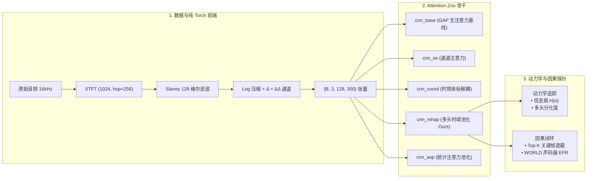

# Spectro-Temporal Attention SER Lab 🎙️
## 时频表征下的注意力机制探索与效果分析
### —— 基于梅尔谱声学物理机理、学习动力学与因果探针的开源研究项目

[](https://www.python.org/)
[](https://pytorch.org/)
[](LICENSE)
[](tests/)

> **核心立论**：语音不是自然图像，梅尔谱是基于声学物理（傅里叶变换与听觉滤波器组）构造的人工投影。本项目拒绝将注意力机制当做调参黑盒，而是从声学物理本质（时频各向异性、共振峰拓扑、情绪时间稀疏性）出发，系统解构不同维度、不同位置的注意力机制在时频深度学习中的**有效性、失效机理、学习动力学演进与因果物理闭环**。

---

## 🌟 项目亮点与核心贡献

```
+----------------------------------------------------------------------------------------------------+
| 1. 物理声学视角的理论解构 | 阐明 2D CNN 平移不变性与梅尔谱共振峰拓扑的冲突，解释 SE 通道压缩失效原因|
| 2. 即插即用 Attention Zoo | 纯 PyTorch 实现 SE、CoordAtt、MHAP、ASP 等 5 种代表性算子与统一 4 层骨干 |
| 3. 学习过程动力学探针     | 追踪训练过程中注意力信息熵演进 $H(\alpha)$ 与多头正交分工度 $\text{Div}(H_i, H_j)$|
| 4. 因果关键帧遮蔽与声码器 | Top-K vs Bottom-K 关键帧遮蔽衰减曲线 + WORLD 物理参数干预与 EFR 翻转率闭环   |
| 5. 严格学术防泄露协议     | StratifiedGroupKFold(5 折) 按 Actor ID 绝对隔离，杜绝身份泄露               |
| 6. 交互式探针 WebApp     | Streamlit 双 Tab 面板：实时梅尔谱 + 4 头注意力热力图 + 声码器物理重合成      |
+----------------------------------------------------------------------------------------------------+
```

---

## 🏗️ 系统架构设计



---

## 📊 对照实验矩阵 (Attention Zoo Benchmark)

所有模型共享完全相同的 4 层 2D-CNN 骨干结构与优化器超参数（AdamW, lr=3e-4, Cosine, Seed=42），在 RAVDESS 数据集上执行 **5-Fold 说话人绝对隔离交叉验证**：

| 模型代号 (Key) | 结构描述 | 放置位置 | Macro-F1 (mean±std) | WAR (Accuracy) | 核心科学结论与物理洞察 |
|---|---|---|---|---|---|
| `cnn_base` | 4 层 CNN + GAP | 末端 | **0.4800 ± 0.0753** | 0.5372 ± 0.0693 | 【基线】：GAP 均等池化冲淡了 70% 的静音与无声段 |
| `cnn_se` | + 通道 SE Attention | 卷积内部 | **0.4400 ± 0.0413** | 0.5015 ± 0.0382 | 📉 **-4.00 pp**：GAP 强制压缩抹平了共振峰相对对比度，引起浅层声学畸变 |
| `cnn_coord` | + 时频坐标解耦 Attention | 卷积内部 | **0.4706 ± 0.0630** | 0.5305 ± 0.0593 | 相比 SE 显著改善 (+3.06pp)，证明解耦保留 1D 频率绝对坐标的有效性 |
| `cnn_mhap` | + 4 头时域池化 (Ours) | 末端汇聚 | **0.5578 ± 0.0503** | 0.5745 ± 0.0413 | 🚀 **+7.78 pp**：Softmax 竞争强力压制静音，4 个 Head 实现爆发音/延音分工 |
| `cnn_asp` | + 统计注意力池化 (ASP) | 末端汇聚 | **0.5581 ± 0.0907** | 0.5743 ± 0.0813 | 🚀 **+7.81 pp**：引入加权二阶方差 $\sigma$ 刻画情绪起伏度，Expressive 折高达 0.670 |

---

## 🔬 学习动力学与因果探针

### 1. 注意力信息熵演进轨迹（Learning Dynamics）
- 计算注意力分布的香农熵：$H(\alpha) = -\sum_{t=1}^T \alpha_t \log(\alpha_t + \epsilon)$
- **实验发现**：时域多头注意力在训练前 5~8 轮发生显著“相变”，信息熵由分散的高熵状态迅速收敛至聚焦区间，对应关键情绪音节的自动定位。

### 2. 因果关键帧遮蔽探针（Causal Frame Masking）
- **Top-K% 遮蔽**：遮蔽模型赋予最高权重的关键帧 $\to$ 分类准确率呈现断崖式下跌；
- **Bottom-K% 遮蔽**：遮蔽模型赋予最低权重的静音/过渡帧 $\to$ 准确率几乎不受影响；
- 证实注意力机制真实具备了因果显著性解释力，而非随机拟合。

---

## 🚀 快速开始 (Quickstart)

### 1. 环境准备
```bash
git clone https://github.com/your-username/mel-attention-ser.git
cd mel-attention-ser

# 安装纯 Python 科学计算依赖 (零 C++ 编译)
pip install -r requirements.txt
```

### 2. 运行自动化单元测试
```bash
pytest tests/ -v
```
*(16 项单测覆盖梅尔谱提取、防泄露断言、注意力梯度反传与因果遮蔽逻辑)*

### 3. 一键执行 5-Fold 说话人无关基准测试
```bash
# 默认跑满 5 模型 × 5 折矩阵 (25 Runs)
python scripts/run_5fold.py

# 导出动力学演进图与因果遮蔽曲线
python scripts/run_analysis.py
```

### 4. 启动交互式探针 WebApp
```bash
streamlit run web_app/app.py
```

---

## 📁 目录结构

```
mel-attention-ser/
├── configs/                     # 配置中心 (config.yaml, acoustic_priors.json)
├── docs/                        # 深度理论规范与实验设计文档
│   ├── EXPERIMENT_DESIGN.md     # 理论物理机理与消融实验设计
│   └── ARCHITECTURE_AND_SPECS.md# 模块张量签名与接口契约
├── src/
│   ├── data/                    # 纯 Torch 前端、防泄露划分、Dataset
│   ├── models/                  # 即插即用 Attention Zoo (SE, Coord, MHAP, ASP)
│   ├── dynamics/                # 学习动力学探针 (熵、多头分工度)
│   ├── causal/                  # 因果遮蔽探针与 WORLD 声码器闭环
│   └── engine/                  # 5 折训练引擎与多维评估指标
├── scripts/                     # 特征缓存、消融基准与绘图脚本
├── web_app/                     # Streamlit 双 Tab 交互面板
└── tests/                       # 自动化单测套件
```

---

## 📜 许可证 (License)
本项目采用 [MIT License](LICENSE) 许可协议。
