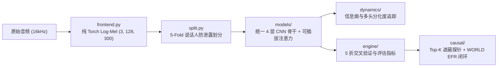

# 系统架构与模块接口规范 (Architecture & Module Specifications)
## —— 纯净、模块化、即插即用的时频注意力实验架构 (v2.0)

> **定位**：定义系统的目录结构、核心模块职责、张量维度签名（Tensor Signatures）与接口协议，保持极简实用，杜绝过度工程。

---

## 1. 顶层架构与数据流动

---

## 2. 核心模块与张量签名

### 2.1 时频前端与数据流 (`src/data/`)

* **`frontend.py`** (`AudioFrontend`):
  * **输入**：`waveform: Tensor (B, T_raw)` @ 16kHz
  * **处理**：
    1. STFT：`n_fft=1024, win_length=1024, hop_length=256`
    2. Slaney 三角滤波器：`n_mels=128, f_min=0, f_max=8000`
    3. 固定帧长：截断/反射填充至 $T=300$ 帧（约 4.8 秒）
    4. 差分通道扩展：静态 Log-Mel + $\Delta$ + $\Delta\Delta$
  * **输出**：`mel_tensor: Tensor (B, 3, 128, 300)`

* **`split.py`** (`SpeakerSplitter`):
  * **协议**：`StratifiedGroupKFold(n_splits=5, shuffle=True, random_state=42)`
  * **约束**：`TrainActors_i ∩ ValActors_i = ∅`
  * **持久化**：`configs/folds.json`

* **`dataset.py`** (`SERDataset`):
  * **折内标准化**：$\widetilde{X} = \frac{X - \mu_{\text{train\_fold}}}{\sigma_{\text{train\_fold}} + \epsilon}$，验证集必须使用对应训练折统计量。

---

### 2.2 注意力算子库与骨干网络 (`src/models/`)

所有模型共享统一输入 `(B, 3, 128, 300)` 与 8 类情绪输出 `(B, 8)`。

#### 核心注意力算子接口 (`blocks.py`):

1. **`SELayer` (通道注意力)**:
   * 输入：$X \in \mathbb{R}^{B \times C \times F \times T}$
   * 计算：$s = \sigma\left( W_2 \text{ReLU}(W_1 \text{GAP}(X)) \right)$
   * 输出：$\widetilde{X} = X \odot s \in \mathbb{R}^{B \times C \times F \times T}$

2. **`CoordinateAttention` (时频解耦坐标注意力)**:
   * 输入：$X \in \mathbb{R}^{B \times C \times F \times T}$
   * 计算：
     - 水平时间条带池化：$z^h = \text{Pool}_F(X) \in \mathbb{R}^{B \times C \times 1 \times T}$
     - 垂直频率条带池化：$z^w = \text{Pool}_T(X) \in \mathbb{R}^{B \times C \times F \times 1}$
     - 经过共享 1D Conv 编码生成时域注意力 $g^t$ 与频域注意力 $g^f$
   * 输出：$\widetilde{X} = X \odot g^t \odot g^f \in \mathbb{R}^{B \times C \times F \times T}$

3. **`MultiHeadAttentivePooling` (多头时域注意力池化，末端)**:
   * 输入：$H \in \mathbb{R}^{B \times T \times D}$ (展平特征投影后)
   * 计算：$u_t^{(k)} = \tanh(W_k H_t), \quad \alpha_t^{(k)} = \text{Softmax}_t(v_k^\top u_t^{(k)}), \quad c_k = \sum_t \alpha_t^{(k)} u_t^{(k)}$
   * 输出：`pooled: Tensor (B, D)`, `attn_weights: Tensor (B, K, T)` (用于动力学与可视化)

4. **`AttentiveStatisticsPooling` (统计注意力池化，末端)**:
   * 输入：$H \in \mathbb{R}^{B \times T \times D}$
   * 计算：$\mu = \sum_t \alpha_t H_t, \quad \sigma = \sqrt{\sum_t \alpha_t (H_t - \mu)^2 + \epsilon}$
   * 输出：`pooled: Tensor (B, 2D)`

---

### 2.3 学习动力学探针 (`src/dynamics/`)

* **`entropy_tracker.py`**:
  * 跟踪并记录注意力在各 Epoch 的平均熵值 $H(\alpha)$，输出收敛曲线数据。
* **`head_diversity.py`**:
  * 计算多头之间的正交度 $\text{Div}(h_i, h_j) = 1 - \cos(\alpha^{(i)}, \alpha^{(j)})$，监控多头分化与坍缩。

---

### 2.4 因果探针与声学闭环 (`src/causal/`)

* **`masking_probe.py`**:
  * `evaluate_masking(model, val_loader, top_k=[0.1, 0.2, 0.3, 0.5], mode='top')`
  * 对比 Top-K 遮蔽与 Bottom-K 遮蔽下的 Macro-F1 下跌曲线。
* **`vocoder.py` & `efr_evaluator.py`**:
  * WORLD 声码器参数分解提取（Harvest $F_0$, CheapTrick $SP$, D4C $AP$）；
  * 基于 `acoustic_priors.json` 执行受控物理干预，生成 $8 \times 8$ EFR 矩阵。

---

## 3. 运行与验证清单

1. **单测验证**：
   - `pytest tests/test_frontend.py`（验证梅尔谱提取与形状契约）
   - `pytest tests/test_leakage.py`（验证 5 折演员划分严格零交集）
   - `pytest tests/test_attention_blocks.py`（验证各注意力模块前向与反向梯度）
2. **消融矩阵**：
   - `python scripts/run_5fold.py --models cnn_base cnn_se cnn_coord cnn_mhap cnn_asp`
3. **分析与可视化**：
   - `python scripts/run_analysis.py`（导出动力学曲线与因果遮蔽图）
   - `streamlit run web_app/app.py`（交互式展示）
