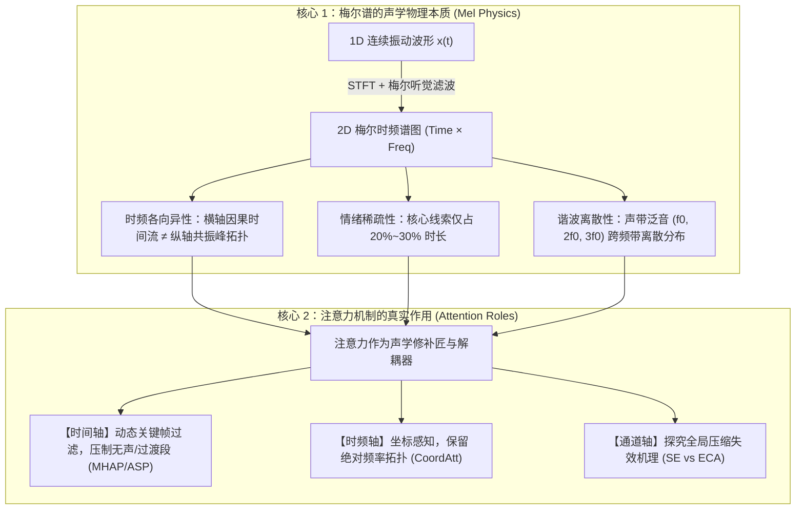
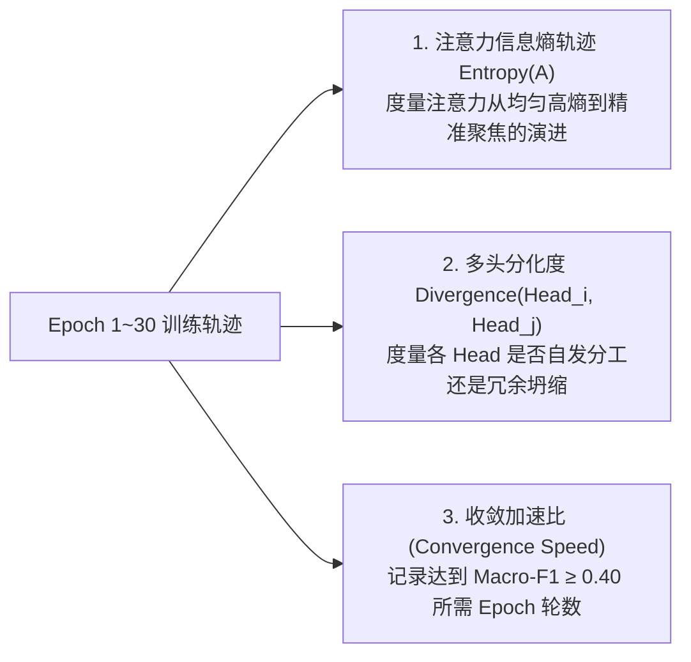
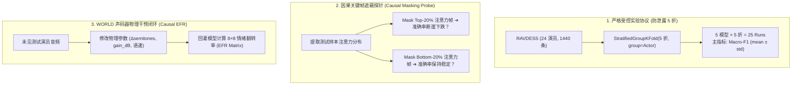

# 时频表征下的注意力机制探索与效果分析
## —— 基于梅尔时频谱与声学物理机理的严谨研究蓝图 (v2.0 实用精炼版)

> **项目定位**：聚焦于**“梅尔时频谱图的物理本质”**与**“注意力机制的学习过程与真实作用”**两大核心，拒绝把注意力当黑盒，通过严谨受控实验、学习动力学探针与因果物理干预，解构注意力在时频深度学习中的有效性与边界。

---

## 1. 核心出发点与科学问题



### 本研究想要回答的四个核心问题：
1. **维度差异**：注意力放在时间轴、频率轴、时频坐标轴或通道轴，各有什么声学物理意义？
2. **位置差异**：放在浅层卷积内部（易引入声学失真） vs 网络末端池化层（高阶关键帧聚合），差异与机理何在？
3. **学习动力学（Learning Dynamics）**：在训练过程中，注意力权重是如何从“均匀分布”演化为“精准聚焦”的？多头注意力是否自发产生了声学分工？
4. **因果与物理有效性**：如何通过遮蔽关键帧或声码器干预，反向证明模型真正学到了声学规律？

---

## 2. 精简实用的注意力动物园 (Attention Zoo)

拒绝冗余堆叠，精选 5 个具有明确物理意义和对照价值的代表性算子：

```
+-------------------+-----------------------------------+------------------------------------+
| 算子名称 (Key)    | 结构与数学形式                    | 对应的声学物理假设与验证目的       |
+-------------------+-----------------------------------+------------------------------------+
| 1. cnn_base (GAP) | 4层CNN + 末端全局平均池化 (GAP)   | 【基线对照】：验证无注意力时，平均 |
|                   |                                   | 池化对稀疏情绪线索的稀释程度。     |
+-------------------+-----------------------------------+------------------------------------+
| 2. cnn_se         | 浅层插入 Squeeze-and-Excitation   | 【通道全局压缩】：验证全局池化压缩 |
|                   | $s = \sigma(W_2 \text{ReLU}(W_1 z))$| 是否会抹平共振峰拓扑而导致失效。   |
+-------------------+-----------------------------------+------------------------------------+
| 3. cnn_coord      | 浅/中层插入 Coordinate Attention  | 【时频解耦坐标】：分别沿 T 与 F 做 |
|                   | 分别做 1D 时间池化与 1D 频率池化  | 条带池化，保留精确频率物理坐标。   |
+-------------------+-----------------------------------+------------------------------------+
| 4. cnn_mhap (Ours)| 末端 4 头时域多头注意力池化       | 【时间动态筛选】：利用 Softmax 竞争|
|                   | $c = \sum \alpha_t^{(k)} u_t$     | 机制压制静音，多头分工捕获声学线索|
+-------------------+-----------------------------------+------------------------------------+
| 5. cnn_asp        | 末端 Attentive Statistics Pooling | 【二阶动态解耦】：同时加权提取均值 |
|                   | 输出加权均值 $\mu$ 与加权方差 $\sigma$| $\mu$ 与方差 $\sigma$，刻画情绪起伏度。|
+-------------------+-----------------------------------+------------------------------------+
```

---

## 3. 学习过程动力学分析 (Learning Dynamics)

在模型训练过程中，记录以下轻量且直观的动力学指标，打开注意力的“学习黑盒”：



1. **信息熵演进（Attention Entropy Evolution）**：
   $$H(\alpha) = -\sum_{t=1}^T \alpha_t \log(\alpha_t + \epsilon)$$
   - *观察重点*：健康的时域注意力会在训练前 5~10 个 Epoch 发生“相变”，熵值明显下降并稳定在特定区间，表征关键帧筛选能力的形成。
2. **多头分化指数（Head Diversity Index）**：
   $$\text{Div}(h_i, h_j) = 1 - \frac{\alpha^{(i)} \cdot \alpha^{(j)}}{\|\alpha^{(i)}\| \|\alpha^{(j)}\|}$$
   - *观察重点*：度量 4 个 Head 之间的余弦正交性，验证不同 Head 是否分别锁定了“句首爆发”、“元音共鸣”与“句尾语调”。

---

## 4. 效果与因果验证体系 (Evaluation & Causality)



### 4.1 说话人无关 5 折防泄露协议
- **分组 Group**：演员 Actor ID（1~24），单测断言每折训练集与测试集演员交集为空；
- **折内标准化**：均值与方差仅基于当前折训练集计算，保留全局响度差异；
- **报告口径**：跨 5 折输出 `Macro-F1 (mean ± std)`、`WAR (Accuracy)`、`UAR (Macro-Recall)`。

### 4.2 因果遮蔽探针（Causal Frame Masking）
- 对测试集样本按注意力大小排序：
  - **遮蔽 Top-K%（核心帧）**：如果注意力有效，模型准确率应急剧下降；
  - **遮蔽 Bottom-K%（无用帧）**：准确率应基本不变甚至微升（去噪效应）；
  - 用一条直观的**“性能衰减曲线（Performance Degradation Curve）”**证实注意力的因果解释力。

### 4.3 声码器物理干预（WORLD EFR 闭环）
- 依据训练集 8 情绪声学物理画像（`configs/acoustic_priors.json`），对未见测试语音施加音高、能量、时长干预；
- 回灌模型生成 $8 \times 8$ **情绪翻转率矩阵（EFR Matrix）**，验证模型是否学到了音高抬升对应愤怒/高兴等声学物理规律。

---

## 5. 项目工程结构与极简设计

系统划分为四个高内聚、纯 Torch 实现的模块：

```
mel-attention-ser/
├── configs/                     # 配置中心
│   ├── config.yaml              # 模型超参、训练轮数、学习率
│   └── acoustic_priors.json     # 8 类情绪物理声学先验表
├── src/
│   ├── data/
│   │   ├── frontend.py          # 纯 Torch 梅尔谱提取 (零外部编译依赖, log-mel+Δ+ΔΔ)
│   │   ├── split.py             # 说话人无关 5 折防泄露划分器
│   │   └── dataset.py           # 折内标准化 Dataset
│   ├── models/
│   │   ├── blocks.py            # 即插即用注意力算子库 (SE, CoordAtt, MHAP, ASP)
│   │   └── backbones.py         # 统一 4 层 2D-CNN 骨干与注册工厂
│   ├── dynamics/
│   │   ├── entropy_tracker.py   # 注意力信息熵记录器
│   │   └── head_diversity.py    # 多头分化度计算器
│   ├── causal/
│   │   ├── masking_probe.py     # Top-K / Bottom-K 因果遮蔽分析器
│   │   ├── vocoder.py           # WORLD 声码器分析与重合成封装
│   │   └── efr_evaluator.py     # EFR 情绪翻转率矩阵计算器
│   └── engine/
│       ├── trainer.py           # 5 折交叉验证训练器
│       └── metrics.py           # Macro-F1, WAR, UAR 计算器
├── scripts/
│   ├── build_cache.py           # 特征预提取落盘
│   ├── run_5fold.py             # 一键跑满 5 模型 × 5 折 (25 runs)
│   └── run_analysis.py          # 导出动力学曲线与因果探针图表
├── web_app/
│   └── app.py                   # Streamlit 交互面板 (梅尔谱 + 注意力热力图 + 实时遮蔽探针)
└── tests/                       # 自动化单测 (防泄露断言、形状契约、梯度反传)
```

---

## 6. 工程化呈现与交付规范

一份出色的研究型实验报告与交付成果应包含：
1. **清晰的动态展示**：梅尔谱与 4 头注意力时域热力图对比；
2. **直观的消融大表**：5 模型在 5-Fold 上的 `Macro-F1 (mean±std)` 性能对比与参数量；
3. **深入浅出的机理总结**：
   - 为什么时域池化有效（时间稀疏性与动态竞争）；
   - 为什么通道 SE 失效（破坏共振峰拓扑）；
   - 动力学与因果探针的真实实验发现。
