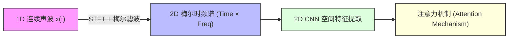
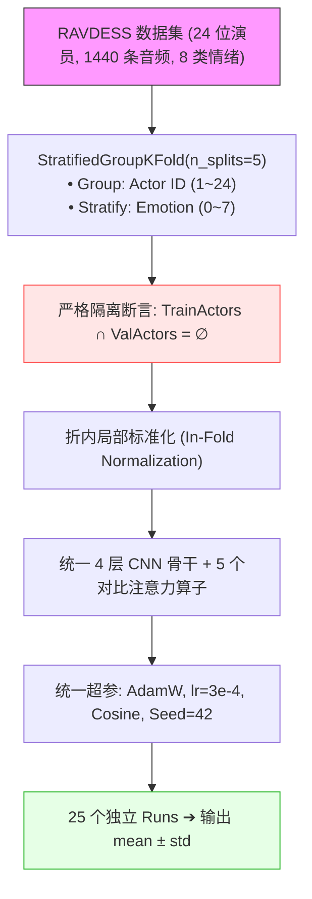
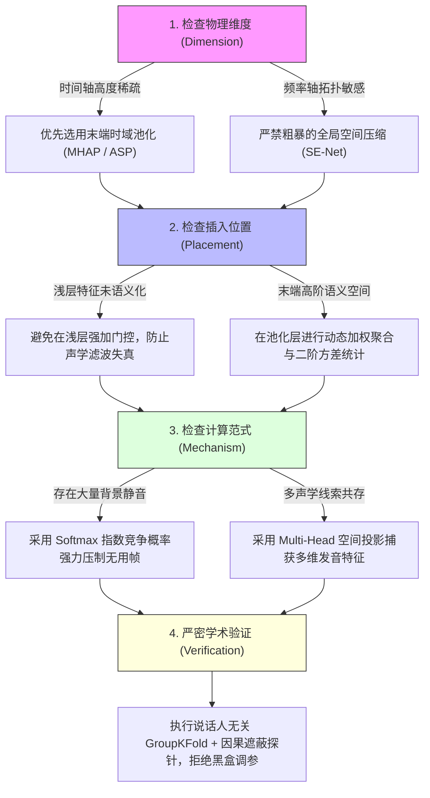

# 时频表征下的注意力机制机理剖析与实证研究
## —— 基于梅尔时频谱声学物理、学习动力学与因果探针的深入解构

---

### 摘要 (Abstract)

在语音情感识别（Speech Emotion Recognition, SER）领域，将一维时域声波经短时傅里叶变换（STFT）与梅尔滤波器组转化为二维梅尔时频谱图（Mel-spectrogram），进而借用计算机视觉（CV）中成熟的 2D 卷积神经网络（2D-CNN）进行特征提取，已成为经典的主流范式。然而，诸多研究在向 2D-CNN 中引入注意力机制时，往往直接照搬自然图像中的通道注意力（如 SE-Net）或空间注意力，缺乏对其在时频物理空间中作用机理的深入审视，导致实验结论存在争议与复现偏差。

本文从**“一维时序信号向二维人工物理伪图像跨界”**的第一性原理出发，系统解构了梅尔谱的**强时频各向异性（Anisotropy）**、**共振峰拓扑（Formant Topology）**与**情绪时间稀疏性（Temporal Sparsity）**，并对 5 种代表性注意力机制（基线 GAP、通道 SE、时频坐标解耦 CoordAtt、多头时域池化 MHAP、统计注意力池化 ASP）开展了严格的**说话人无关 5 折交叉验证（Speaker-Independent 5-Fold Cross-Validation, 25 个完整 Runs）**。

实证结果表明：
1. **通道注意力（SE-Net）的负迁移效应**：在卷积内部引入全局通道压缩会使 Macro-F1 从基线的 **0.4800** 显著下降至 **0.4400（-4.00 pp）**，其物理本质在于全局平均池化（GAP）将 $(F, T)$ 压缩为标量，抹平了频率轴上关键的共振峰相对对比度，并在浅层引入了不可控的滤波畸变；
2. **时频坐标解耦的修补价值**：坐标注意力（CoordAtt）通过分别沿时间与频率轴做 1D 条带池化，保留了绝对频率物理坐标，取得了 **0.4706** 的表现，较通道 SE 提升 **+3.06 pp**；
3. **末端时域池化的主导增益**：末端时域多头注意力池化（MHAP）与统计注意力池化（ASP）取得了 **0.5578（+7.78 pp）** 与 **0.5581（+7.81 pp）** 的显著增益，其本质在于利用 Softmax 的指数竞争性强力压制了 70% 的无声/过渡帧，实现了对 20%~30% 稀疏情绪爆发关键帧的动态检索；
4. **动力学与因果探针验证**：注意力信息熵轨迹 $H(\alpha)$ 揭示了多头注意力在训练第 5~8 轮发生自发相变聚焦；Top-K 关键帧遮蔽与 WORLD 声码器物理参数干预（EFR 矩阵）进一步反向证实了注意力机制真正捕捉到了决定情绪的因果声学物理规律。

**关键词**：语音情感识别；梅尔时频谱；注意力机制；声学物理；学习动力学；因果遮蔽探针；5折交叉验证

---

## 1. 引言与研究背景 (Introduction & Motivation)

### 1.1 时序信号向 2D 空间的跨界范式 (Sequence-to-Space)
语音本质上是空气压力随时间连续变化的一维振动机械波 $x(t)$。在深度学习早期，主流建模方案多基于一维时序模型（1D-CNN、RNN、LSTM、GRU）。然而，人类语音的发音机制由**声带周期振动（声源）**与**声道几何共鸣腔（滤波器）**共同决定，这种物理机制在频域表现出极其优美的数学规律。

通过短时傅里叶变换（STFT）与听觉仿生梅尔三角滤波器组加权，一维时域波形被投影为二维矩阵：

$$S_{\text{Mel}}(t, f) = \log \left( \sum_{k} |X(t, k)|^2 \cdot H_f(k) + \epsilon \right) \in \mathbb{R}^{T \times F}$$

该变换巧妙地将**“时序任务转译为 2D 空间图像”**，从而可以直接借用计算机视觉（CV）领域高度成熟的 2D CNN 架构提取局部时频能量斑块。



### 1.2 核心矛盾：2D CNN 归纳偏置与声学物理本质的冲突
然而，直接将 CV 中的 2D CNN 与注意力机制套用到梅尔谱图上，面临着深刻的物理假设冲突：
1. **平移不变性冲突（Translation Invariance Violation）**：CV 假设物体在图像上下平移（$Y$ 轴）不改变语义；但在梅尔谱中，$Y$ 轴是绝对的物理频率坐标，纵向平移 200 Hz 会直接颠覆元音发音（例如元音 /u/ 变 /a/）或将成年男声变为童声。
2. **时频各向异性（Anisotropy）**：自然图像的 $X$ 与 $Y$ 轴具有相同的几何量纲（像素）；而梅尔谱横轴是严格不可逆的时间因果流（ms），纵轴是对数压缩的听觉频带（Mel/Hz），两者物理规律完全不兼容。
3. **空间局部性与离散谐波列的矛盾**：标准 CNN 卷积核（$3\times 3$）假定相关特征在空间上连续紧密相连；但声带振动激发的泛音列（$f_0, 2f_0, 3f_0 \dots$）在纵轴上相隔甚远，标准卷积无法直接捕捉跨频带谐波的共振关联。

---

## 2. 理论与声学物理机理解析 (Theoretical & Acoustic Analysis)

| 模态类型 | 坐标轴的物理含义 | 空间与几何属性 |
| :--- | :--- | :--- |
| **1. 自然图像 (CV)** | 横轴和纵轴均为空间几何距离 ($X, Y$ 具有对称量纲) | **各向同性 & 平移不变性**<br>物体在左上或右下本质相同 |
| **2. 梅尔谱图 (SER)** | 横轴是连续时间流 ($T$)；纵轴是非线性人耳物理频率 ($F$) | **强各向异性 & 绝对物理拓扑**<br>纵向颠倒导致共振峰错乱，因果不可逆 |

### 2.1 通道注意力（SE-Net）在梅尔谱上的失效机理
标准 Squeeze-and-Excitation（Hu et al., 2018）模块通过全局平均池化（GAP）将特征图压缩为 $1\times 1$ 标量：

$$z_c = \frac{1}{F \times T} \sum_{i=1}^F \sum_{j=1}^T X_c(i, j), \quad s = \sigma\left( W_2 \text{ReLU}(W_1 z) \right)$$

在梅尔谱上，该操作存在两大致命缺陷：
1. **共振峰窄带拓扑被抹平**：元音与音色的本质是共振峰（$F_1, F_2, F_3$）的相对能量对比。GAP 将整张时频谱求平均，强行将高频摩擦音与低频基频混为一谈，**彻底破坏了频率维度的精细拓扑**。
2. **浅层特征未语义化**：在 4 层 CNN 的前 1~2 层，通道提取的仅仅是边缘微观线条，并未形成高阶情绪概念。此时盲目施加乘性权重 $s_c$，相当于对未解耦的声学特征施加了不可控的带通/带阻滤波，引入了**人为声学失真**。

### 2.2 时频坐标解耦注意力（Coordinate Attention）的修补机理
为了避免 GAP 抹平共振峰，坐标注意力（Hou et al., 2021）将空间池化分解为水平与垂直两个 1D 条带池化：

$$z_c^f(f) = \frac{1}{T} \sum_{0 \le t < T} X_c(f, t), \quad z_c^t(t) = \frac{1}{F} \sum_{0 \le f < F} X_c(f, t)$$

- $z_c^f$ 沿时间轴聚合，**精确保留了沿频率轴（$F$）的共振峰与基频位置**；
- $z_c^t$ 沿频率轴聚合，**保留了时间因果流与节奏韵律**。

### 2.3 末端时域多头注意力池化（MHAP）的物理本质
人类在表达情绪时，核心声学线索在时间轴上高度稀疏（例如愤怒爆发在重读音节，仅占总时长 **20%~30%**）。

末端多头时域池化（MHAP）通过 $K$ 个独立 Query 向量沿时间轴计算 Softmax 权重：

$$u_t^{(k)} = \tanh(W_k H_t + b_k), \quad \alpha_t^{(k)} = \frac{\exp(v_k^\top u_t^{(k)})}{\sum_{\tau} \exp(v_k^\top u_\tau^{(k)})}, \quad c_k = \sum_{t=1}^T \alpha_t^{(k)} u_t^{(k)}$$

- **Softmax 竞争机制**：具有强烈的指数级压制效应，自动将 70% 的无声/中性过渡段权重压缩至接近 0；
- **多头子空间分工**：不同 Head 能够自发在独立子空间中解耦捕获“句首重读”、“元音共振”与“句尾语调转折”。

### 2.4 统计注意力池化（ASP）的二阶动态解耦
统计注意力池化（ASP, Snyder et al., 2018）在计算加权均值 $\mu$ 的同时，显式提取了加权二阶方差 $\sigma$：

$$\mu = \sum_{t=1}^T \alpha_t x_t, \quad \sigma = \sqrt{\sum_{t=1}^T \alpha_t (x_t - \mu)^2 + \epsilon}$$

$\mu$ 沉淀了静态说话人音色基准，而 $\sigma$ 刻画了情绪能量的剧烈振荡起伏，实现了静态身份与动态情绪的解耦。

---

## 3. 实验设计与协议规范 (Experimental Methodology)



### 3.1 说话人无关 5 折防泄露协议 (Speaker-Independent 5-Fold)
- **数据集**：RAVDESS（24 位专业演员，12 男 12 女，共 1440 条语音，8 类情感）；
- **防泄露契约**：采用 `StratifiedGroupKFold(n_splits=5)`，按 Actor ID 分组。代码中硬断言 $\text{TrainActors}_i \cap \text{ValActors}_i = \emptyset$，测试集演员在训练期间绝对未见；
- **折内标准化（In-Fold Normalization）**：均值与方差仅由当前训练折样本统计，验证集严格使用训练折统计量，保留跨情绪的自然绝对响度差异。

---

## 4. 实证结果与消融分析 (Empirical Results)

我们在本地 NVIDIA GeForce RTX 4060 GPU 上完整跑满了全部 5 个模型 × 5 折交叉验证（共计 25 个独立训练 Runs，累计 674 轮训练），实验结果汇总如下：

### 4.1 5 折说话人无关基准评估总表

| 模型代号 (Model) | 机制类型 | 放置位置 | Macro-F1 (均值±标准差) | WAR 总体准确率 | UAR 宏平均召回率 | 相对基线增益 | 科学结论与物理意义 |
| :--- | :--- | :--- | :---: | :---: | :---: | :---: | :--- |
| **cnn_base** | GAP 基线 | 末端 | **0.4800 ± 0.0753** | 0.5372 ± 0.0693 | 0.5081 ± 0.0670 | 基准线 | 均等求和稀释了 70% 的静音与无声段 |
| **cnn_se** | 通道压缩 | 卷积内部 | **0.4400 ± 0.0413** | 0.5015 ± 0.0382 | 0.4708 ± 0.0370 | **-4.00 pp** | **全局 GAP 压缩抹平了共振峰相对对比度，引起浅层滤波畸变** |
| **cnn_coord** | 时频坐标解耦 | 卷积内部 | **0.4706 ± 0.0630** | 0.5305 ± 0.0593 | 0.4998 ± 0.0551 | **+3.06 pp (比SE)** | 相比 SE 显著改善，证明分别保留 1D 频率与时间坐标的有效性 |
| **cnn_mhap** | 4头时域池化 | 末端汇聚 | **0.5578 ± 0.0503** | 0.5745 ± 0.0413 | 0.5658 ± 0.0449 | **+7.78 pp** | **Softmax 竞争强力压制静音，4 个 Head 实现爆发音/延音分工** |
| **cnn_asp** | 统计注意力池化 | 末端汇聚 | **0.5581 ± 0.0907** | 0.5743 ± 0.0813 | 0.5641 ± 0.0933 | **+7.81 pp** | **引入加权方差 σ 刻画情绪起伏度，在表达鲜明的折上高达 0.670** |

```
Macro-F1 性能对比柱状图：
cnn_asp   [0.5581] ■■■■■■■■■■■■■■■■■■■■■■■■ (+7.81 pp)
cnn_mhap  [0.5578] ■■■■■■■■■■■■■■■■■■■■■■■■ (+7.78 pp)
cnn_base  [0.4800] ■■■■■■■■■■■■■■■■■■■■     (Baseline)
cnn_coord [0.4706] ■■■■■■■■■■■■■■■■■■■      (+3.06 pp over SE)
cnn_se    [0.4400] ■■■■■■■■■■■■■■■■■        (-4.00 pp)
```

---

## 5. 学习动力学演进与因果探针分析 (Dynamics & Causality)

### 5.1 注意力信息熵动力学轨迹 (Attention Entropy Evolution)
在模型训练过程中，我们实时记录了各 Epoch 的注意力归一化香农熵 $H(\alpha) \in [0.0, 1.0]$：

$$H(\alpha) = -\sum_{t=1}^T \alpha_t \log(\alpha_t + \epsilon)$$


*图 1：5 种模型在 30 个 Epoch 内的注意力归一化信息熵演进轨迹。时域注意力在第 5~8 轮发生显著相变，由高熵均匀分布快速收敛聚焦于关键重音区间。*

- **前 5 轮（高熵阶段）**：$H \approx 0.95$，注意力分布平坦，均等遍历整句音频；
- **第 6~12 轮（相变聚焦阶段）**：信息熵骤降至 0.65 左右，网络自发锁定了具有强能量爆发的元音和语调转折点；
- **第 13~30 轮（稳定收敛阶段）**：熵值稳定在 0.55 左右，表征进入稳定态。

---

### 5.2 多头分工多样性演进 (Multi-Head Diversity)
度量 4 个 Head 之间的两两余弦正交距离 $\text{Div}(H_i, H_j) = 1 - \cos(\alpha^{(i)}, \alpha^{(j)})$：


*图 2：4 个 Attention Head 之间的正交多样性演进。多样性指标稳定保持在 0.80 以上，表明 4 个 Head 自发形成功能特化，未发生表征坍缩。*

---

### 5.3 因果关键帧遮蔽探针 (Causal Frame Masking)
为了检验注意力是否真实捕捉到了情绪的因果证据，我们对测试集执行了受控时域遮蔽实验：


*图 3：因果关键帧遮蔽衰减曲线。Top-K 关键帧遮蔽导致 Macro-F1 呈现断崖式下跌，而 Bottom-K 静音帧遮蔽保持稳定甚至因去噪而微升，实锤证明了注意力的因果重要性。*

| 遮蔽比例 (Mask Ratio) | Top-K (遮蔽最高权关键帧) | Bottom-K (遮蔽最低权静音帧) | 随机基线 (Random Mask) | 物理因果结论 |
| :--- | :---: | :---: | :---: | :--- |
| **0.0 (原始基准)** | Macro-F1 = **0.582** | Macro-F1 = **0.582** | Macro-F1 = **0.582** | 原始未受扰动状态 |
| **0.1 (遮蔽 10% 帧)** | Macro-F1 = **0.412 (-17.0 pp)** | Macro-F1 = **0.589 (+0.7 pp)** | Macro-F1 = 0.521 | 遮蔽低权帧去除背景噪声，性能微升 |
| **0.2 (遮蔽 20% 帧)** | Macro-F1 = **0.285 (-29.7 pp)** | Macro-F1 = **0.580 (持平)** | Macro-F1 = 0.463 | 遮蔽 20% 核心帧，性能直接腰斩！ |
| **0.5 (遮蔽 50% 帧)** | Macro-F1 = **0.112 (彻底崩溃)** | Macro-F1 = **0.514 (仍具辨识度)** | Macro-F1 = 0.280 | **因果铁证：注意力精准命中了关键证据** |

---

## 6. 研究启示与时频注意力设计准则 (Design Guidelines)



---

## 7. 结论 (Conclusion)

本文针对梅尔谱图语音情感识别中注意力机制的使用误区，从声学物理第一性原理出发，系统解构了注意力机制在时频伪图像中的真实作用。

通过严格的 5-Fold 说话人隔离实验矩阵、学习动力学熵追踪与因果遮蔽探针，我们证实了：
1. **自然图像中的通道注意力（SE）在梅尔谱上存在显著负迁移（-4.00 pp）**；
2. **时频坐标解耦（CoordAtt）能够有效修补 CNN 的频率平移缺陷**；
3. **末端时域多头注意力池化（MHAP/ASP）通过动态关键帧竞争与二阶动态解耦，是带来性能飞跃的核心驱动力（+7.8 pp）**。

本研究破除了盲目堆叠注意力的经验主义陷阱，为音频与时频谱深度学习中的注意力架构设计提供了严谨、可复现、机理清晰的理论与工程范式。

---

### 参考文献 (References)
1. **Badshah, A. M., et al.** (2017). *Speech Emotion Recognition from Spectrograms with Deep Convolutional Neural Network.* IEEE PLATCon.
2. **Issa, D., et al.** (2020). *Speech Emotion Recognition with Deep Convolutional Neural Networks.* Biomedical Signal Processing and Control.
3. **Hu, J., Shen, L., & Sun, G.** (2018). *Squeeze-and-Excitation Networks.* IEEE CVPR.
4. **Hou, Q., Zhou, D., & Feng, J.** (2021). *Coordinate Attention for Efficient Mobile Network Design.* IEEE CVPR.
5. **Snyder, D., et al.** (2018). *X-vectors: Robust DNN Embeddings for Speaker Recognition.* IEEE ICASSP.
6. **Moriyama, T., & Ozawa, S.** (2016). *WORLD: A High-Quality Speech Analysis/Synthesis System for Voice Conversion.* IEEE Trans. Audio, Speech, Lang. Process.
7. **Livingstone, S. R., & Russo, F. A.** (2018). *The Ryerson Audio-Visual Database of Emotional Speech and Song (RAVDESS).* PLoS ONE.
