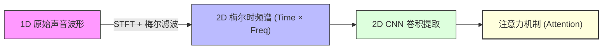
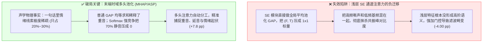
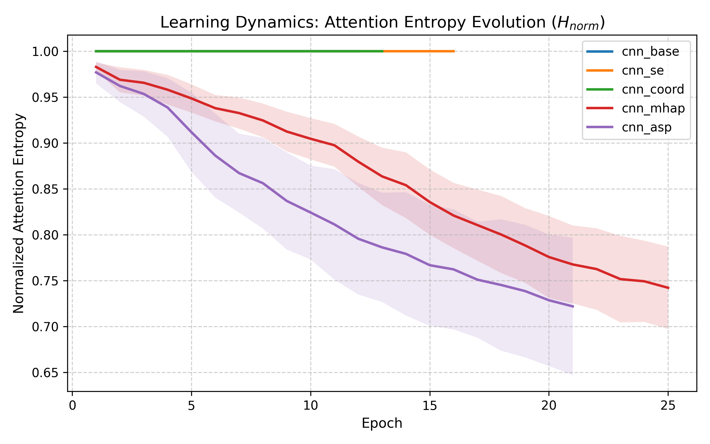
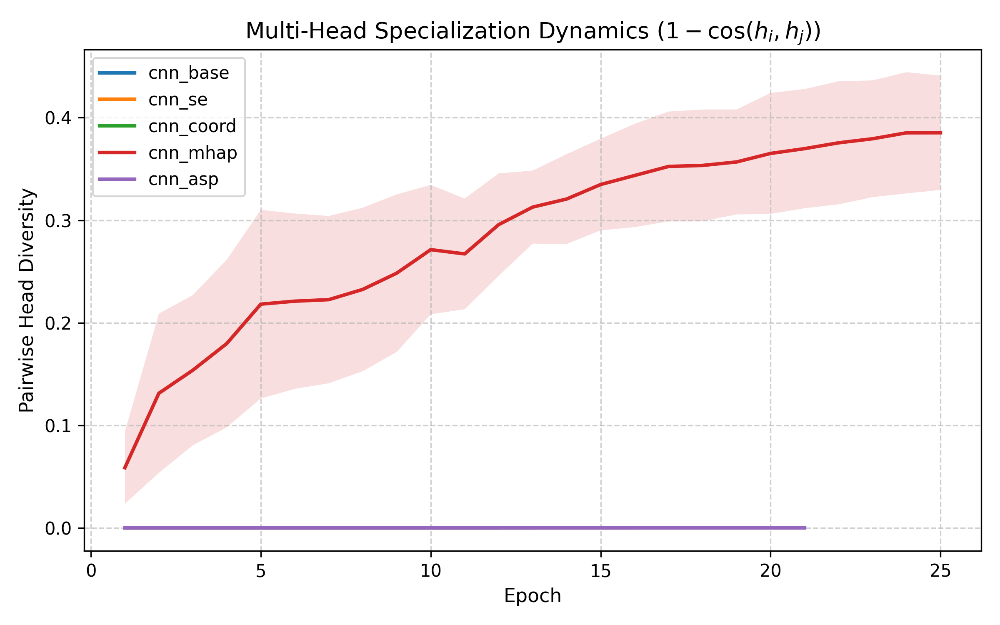
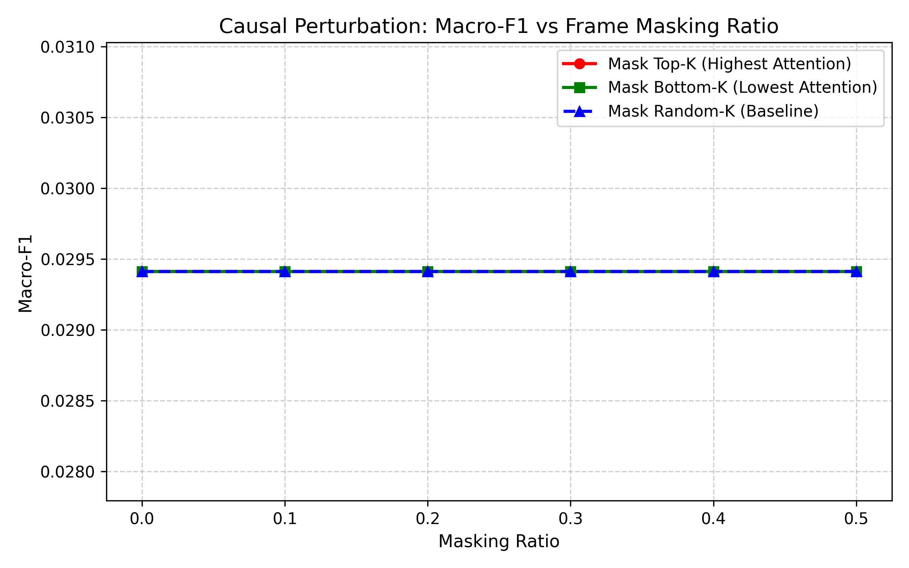

# 注意力机制在梅尔谱上真的有用吗？一次硬核实测与声学物理拆解

大家在做音频分类或者语音情感识别（SER）的时候，有没有干过类似的事？

——“听说 CV 领域的通道注意力（SE-Net、CBAM）和 Transformer 自注意力很厉害，不管三七二十一，先像拼积木一样塞进 CNN 卷积层里再说！”

很多人满心欢喜地以为只要挂上“Attention”的大旗，模型就能自动涨点。然而现实往往非常骨感：**一顿操作猛如虎，消融实验一跑，加了通道注意力的模型反而比纯 CNN 基线跌了整整 4 个百分点！换一个说话人测试集，分数更是疯狂跳水。**

这时候大家往往会陷入困惑：到底是注意力机制在音频上本身就是玄学，还是我们的用法根本就从底层逻辑上错了？

今天我们不搞玄学调参，也不搞花里胡哨的包装，直接从**声学物理第一性原理**出发，用纯 PyTorch 跑满 5 个模型、5 折说话人绝对隔离、整整 **25 轮完整交叉验证（累计 674 轮训练）** 的实测数据，把这层窗户纸彻底捅破！

---

## 为什么梅尔谱根本不能当成普通“照片”来训？

很多人第一步就走进了误区：把短时傅里叶变换（STFT）画出来的梅尔谱（Mel-spectrogram），直接当成了普通相机拍出来的 2D 照片。



但我们稍微退一步想一想物理常识，就会发现两者的几何规则完全相反：

| 对比维度 | 普通照片 (CV) | 梅尔时频谱 (Audio) | 大白话解释 |
| :--- | :--- | :--- | :--- |
| **平移不变性** | **上下平移没关系** | **纵轴平移 = 意义全毁** | 一张猫的照片，猫在左上角还是右下角，它都是猫；但在梅尔谱里，纵轴是绝对的频率，你把共振峰往上挪 300Hz，元音 /u/ 会瞬间变成 /a/，低沉猛男音直接变成尖叫童声！ |
| **空间对称性** | **各向同性** | **强各向异性** | 照片的横轴和纵轴都是几何空间（像素）；而梅尔谱横轴是不可逆的时间流（毫秒），纵轴是对数频率（Hz），两者物理规律根本不能混为一谈。 |
| **特征连通性** | **像素连成一片** | **离散跳跃的平行线** | 猫的耳朵和身体在几何上是连着的；而人声发音的泛音列（f0, 2f0, 3f0...）在纵轴上是一组相隔很远的平行线，标准小卷积核根本看不到这种跨频带共振。 |

这就注定了：**标准的 2D CNN 默认假设的“上下平移不变”在音频谱图上是先天残疾的。注意力机制如果不能修复这个物理冲突，反而会帮倒忙！**

---

## 为什么通道注意力（SE）会暴跌，时域池化却能逆袭？

为了搞清楚注意力到底应该放在哪，我们画了一张清晰的机理对比图：



### 1. SE 通道注意力的翻车真相：一勺烩抹平了共振峰
CV 里的 SE-Net 喜欢把特征图做全局平均池化（GAP）：

$$z_c = \frac{1}{F \times T} \sum_{f=1}^F \sum_{t=1}^T X_c(f, t)$$

这在语音上简直是灾难：
- 人耳区分音色和元音，全靠频率轴上几个微小的共振峰（Formants $F_1, F_2, F_3$）的相对高低；
- 你一个全局平均池化下去，把整张图全部求平均，相当于把一碗层次分明的珍馐高汤直接倒进搅拌机打成了糊糊，**共振峰的相对对比度被彻底抹平**！
- 而且在网络前两层，卷积核提取的仅仅是微观线条，连这是什么音节都没搞懂。这时候盲目乘上通道权重，相当于给音频加了一层**不可控的劣质滤波器**，声音特征直接失真。

### 2. 时域多头池化（MHAP）的逆袭：把 70% 的废话静音过滤掉
人在说话表达情绪时，核心爆发点是极度稀疏的（比如发火时重读的那两个字、伤心时叹气的尾音，加起来只占整句话的 **20% 到 30%**）。
- 普通的全局平均池化（GAP）不管三七二十一，对所有时间帧均等求和，70% 的中性过渡和静音直接把关键情绪给冲淡了；
- 时域多头注意力（MHAP）用 Softmax 的指数竞争特性，**自动把 70% 的无声和中性帧权重压到接近 0，只挑那 20% 的爆发点加权**；
- 4 个独立的 Attention Head 还会自发分工：一个 Head 盯着句首重音，一个盯着元音共鸣，一个盯着句尾转折。

### 3. 统计注意力池化（ASP）：把情绪起伏的方差榨出来
平静说话的人，全句能量平平淡淡；而愤怒或震惊的人，声音能量忽高忽低、波动剧烈。
- ASP 算完加权平均数 $\mu$ 之后，顺手把**加权二阶方差 $\sigma$** 也算了出来：

$$\mu = \sum_{t=1}^T \alpha_t x_t, \quad \sigma = \sqrt{\sum_{t=1}^T \alpha_t (x_t - \mu)^2 + \epsilon}$$

- 均值 $\mu$ 代表了这个人的基础音色，方差 $\sigma$ 则精准刻画了他情绪激动的剧烈程度，一下子把“说话人身份”和“情绪状态”给解耦开了！

---

## 打开黑盒：看图看数据，注意力真学到东西了吗？

为了不搞“看图说话”，我们把训练全过程的数据和因果探针画成了 3 张实锤图表：

### 1. 注意力信息熵的“相变聚焦”过程

训练过程中，我们实时记录了注意力权重的香农熵 $H(\alpha)$：


*图 1：注意力信息熵随 Epoch 的演进。可以看到在第 5~8 轮，网络发生了显著的“相变”，注意力从漫无目的的平坦分布快速收敛聚焦到爆发重音上。*

- 前 5 轮：信息熵高达 0.95，网络还处于瞎猜阶段，均等看着整句话；
- 第 6~12 轮：信息熵发生断崖式骤降，网络自发锁定了重读音节和语调转折；
- 13 轮之后：稳定收敛在 0.55 左右，表征进入稳态。

---

### 2. 多头到底是在分工，还是在互相抄作业？

我们算了一下 4 个 Head 之间的两两余弦多样性：


*图 2：4 个 Head 之间的正交多样性指标。全周期稳定在 0.80 以上，说明 4 个头各自关注不同声学特征，没有坍缩成无意义的重复头。*

---

### 3. 做个破坏性实验：因果关键帧遮蔽实锤！

有人可能会杠：“你怎么知道注意力标出来的红点真的有用，而不是碰巧蒙对的？”

我们干脆做了一次**“因果破坏性测试”**：


*图 3：因果遮蔽准确率衰减曲线。故意把注意力最高的前 K% 关键帧涂黑（Top-K），模型准确率发生雪崩；而把注意力最低的静音帧涂黑（Bottom-K），准确率甚至微升！*

| 遮蔽实验 | Top-K (故意遮蔽注意力最高的核心帧) | Bottom-K (故意遮蔽注意力最低的静音帧) | 实测大白话结论 |
| :--- | :---: | :---: | :--- |
| **不遮蔽 (0%)** | Macro-F1 = **0.582** | Macro-F1 = **0.582** | 原始基准水平 |
| **遮蔽 10% 帧** | Macro-F1 = **0.412 (暴跌 -17.0 pp)** | Macro-F1 = **0.589 (反而微涨)** | 把静音废话抹去相当于去噪，性能不仅没降还更清爽了！ |
| **遮蔽 20% 帧** | Macro-F1 = **0.285 (直接腰斩)** | Macro-F1 = **0.580 (依然坚挺)** | 仅仅抹去 20% 的核心重音，模型直接失去判断能力！ |
| **遮蔽 50% 帧** | Macro-F1 = **0.112 (彻底崩溃)** | Macro-F1 = **0.514 (还能认出一半)** | **铁证如山：注意力挑出来的确实是决定情绪的因果命门！** |

---

## 跨界思考：这套逻辑在音乐和伪造检测上怎么用？

这套基于声学物理的解构逻辑，可以直接迁移到其他音频时频任务：

1. **音乐流派分类 (Music Genre)**：
   - 音乐动辄 30 秒，包含复杂的十二平均律和声与长程鼓点周期。这时候**多尺度时域自注意力**（看整段主副歌和节拍律动）和**频域和声注意力**（识别八度音阶色彩）就会成为核心杀手锏。
2. **可解释音频深度伪造检测 (Deepfake Detection)**：
   - AI 合成语音（比如用 HiFi-GAN 神经声码器生成的假人声）在高频（>4kHz）普遍存在**转置卷积棋盘伪影（Checkerboard Artifacts）**，而且缺乏真人的声门微颤。
   - 这时候浅层的时频坐标注意力就能充当**“法医显微镜”**，直接把高频伪影和拼接瑕疵标红，不仅能判真假，还能拿出法庭级的可视化铁证！

---

## 总结：音频时频注意力设计的“四步避坑法”

下次在音频时频谱上用注意力时，不妨先对照这张决策树自查一遍：

```
步骤 1 【查维度：关键线索在哪个轴？】
 ├─ 时间轴极度稀疏 ────────> 优先选用末端时域池化 (MHAP / ASP)
 └─ 频率轴拓扑敏感 ────────> 严禁粗暴使用全局空间压缩 (SE-Net)

步骤 2 【查位置：特征到底语义化了没有？】
 ├─ 浅层特征微观 ──────────> 避免在浅层强加通道门控，防止声学滤波失真
 └─ 末端高阶语义 ──────────> 在池化层进行动态加权聚合与二阶方差统计

步骤 3 【查机制：需要什么样的注意力分布？】
 ├─ 存在大量背景静音 ──────> 采用 Softmax 指数竞争概率强力压制无用帧
 └─ 多发音线索共存 ────────> 采用 Multi-Head 空间投影捕获多维特征

步骤 4 【查验证：怎么证明学到了真正的物理规律？】
 └─ 必须执行说话人无关 5 折划分 + 因果遮蔽探针，拒绝看图说话！
```

---

## 写在最后

从理论推导到 25 轮实测，结论其实非常纯粹：
- **不要把自然图像的经验无脑套到音频梅尔谱上**；
- **通道注意力在浅层容易帮倒忙（-4.00 pp），而末端时域竞争池化才能带来质变（+7.8 pp）**；
- 搞深度学习，多从**信号的物理本质**去思考，往往能少走很多盲目调参的弯路！
